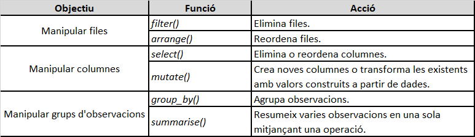
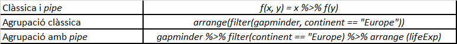

### Variables i ordenació de data.frames en R


#### Primer pas

Recordem que treballarem amb el projecte que tenim obert per a les classes pràctiques i que vam crear el primer dia. 

### Les variables a R

R és un programa d’anàlisi estadístic de dades que ens permet analitzar, descriure i operar amb variables com les que hem acabat d’estudiar. Ens permet aplicar totes les tècniques estadístiques que veurem al llarg de les properes sessions però també ens permet recopilar dades i emmagatzemar-les d’una determinada forma. Per tant, en les bases de dades que carreguem a R identificar totes les tipologies de variables que hem estudiat a nivell teòric. 

Tanmateix, hem de tenir clar abans d’analitzar una variable a R provinent d’una determinada base de dades el que caracteritza a cada tipus de variable, quina forma prenen i quin tipus d’informació volem obtenir. En aquest apartat farem un repàs de com les trobarem en el programa R.


#### Les variables categòriques nominals en R

En primer lloc, tenim tres tipus de variables categòriques (nominals, ordinals o binàries), que podem emmagatzemar a R com a vectors de caràcter, factors o vectors lògics:

  •	Com a vectors de caràcter

Els vectors de caràcter o strings emmagatzemen tot tipus de caràcters, des de lletres fins a símbols especials. Sempre utilitzarem les cometes per a referir-nos a cada valor. 


Crearem un vector de caràcter a R de la següent manera:

```{r}
vector_caracter <- c("Kuwait", "Qatar", "Saudi Arabia", "Bahrain")
```

  •	Com a vectors enters en forma de factors
  

Un factor és un vector enter que emmagatzema informació categòrica. Normalment crearem els factors a partir d’un vector caràcter i el passarem a factor amb la funció factor() o as.factor().


Primera forma de crear-ho:

```{r}
paisos <- factor(c("BRA", "ARG", "VEN", "URU", "PAR")) 
```

Segona forma de crear-ho. Creem un vector de caràcter:

```{r}
paisos <- c("BRA", "ARG", "VEN", "URU", "PAR")
```

El transformem en un factor amb la funció as.factor():

```{r}
as.factor(paisos)
```

Observem el vector i les seves categories:
```{r}
paisos
levels(paisos)
```

Ara podem modificar els nivells o canviar els noms de la següent manera:

```{r}
levels(paisos) <- c("Brazil","Argentina","Venezuela", "Uruguay", "Paraguay")
paisos #Comprovem el resultat
```

Si volem també podem modificar les categories a través d'un argument a la funció factor().

```{r}
factor(paisos, labels = c("Argentina", "Brazil", "Paraguay", "Uruguay", "Venezuela"))
```

  •	Com a vectors lògics


Les variables categòriques nominals també poden prendre la forma d’un vector lògic, en què la variable només pot tenir dos valors discrets i normalment no ordenables: veritat (TRUE) i fals (FALSE). En aquest cas es tractarà d’una variable binària (també dita dicotòmica, booleana o dummy), que normalment serveix per a indicar la presència o absència d’un determinat concepte. Si el concepte és present, la variable pren el valor lògic TRUE, si el concepte és absent, pren el valor lògic FALSE.

Per comprovar-ho, crearem un vector lògic de la següent manera:

```{r}
vector_logic <- c(TRUE, FALSE, FALSE, TRUE)
```

#### Les variables categòriques ordinals en R

Les variables ordinals són variables categòriques que es poden ordenar de manera lògica. És a dir, segueixen un ordre determinat. Aquestes variables les podem emmagatzemar com a vectors de caràcter, factors o vectors lògics, encara que amb algunes petites diferències en relació als factors i els vectors lògics.

  •	Com a factors:

Els factors són una de les eines principals que tenim per a emmagatzemar variables categòriques. El seu gran potencial és la manera com poden guardar variables ordinals, ja que tenen la capacitat d’ordenar les categories seguint l’ordre que indiquem.

El seu gran potencial és la manera com poden guardar variables ordinals, ja que tenen la capacitat d’ordenar les categories seguint l’ordre que indiquem.

```{r}
wb <- data.frame(country = c("Antigua and Barbuda", "Belize", "Costa Rica", "Dominica", "Dominican Republic",
                             "El Salvador", "Guyana", "Guatemala", "Haiti", "Honduras", "Jamaica", "Nicaragua", 
                             "Panama", "Surinam", "Trinidad and Tobago"), 
                 income = factor(c("high", "upper-middle", "upper-middle","upper-middle", "upper-middle", 
                                   "lower-middle", "upper-middle", "upper-middle","low", "lower-middle", "upper-middle",
                                   "lower-middle", "high", "upper-middle", "high")),
                 stringsAsFactors = FALSE)

```

Imprimim el marc de dades teclejant wb. Fixeu-vos en el procediment per convertir un factor en ordinal:

  •	A dins de la funció factor(), indiquem que l’argument order a TRUE.
     
  •	Indiquem a l’argument levels l’ordre dels factors, de menor a major.

```{r}
wb$income <- factor(wb$income, order = TRUE, levels = c("low", "lower-middle", "upper-middle", "high"))
```

Comproveu el resultat amb:

```{r}
class(wb$income)
wb$income
```


  •	Com a vectors lògics

Els vectors lògics també poden operar com a variable categòrica ordinal pel simple fet que TRUE és convertible a 1 i FALSE és convertible a 0. 

Fixem-nos què passa si convertim un vector lògic a vector numèric:

```{r}
as.numeric(c(TRUE, FALSE))
```

Això significa que TRUE pot ser interpretat com un 1 i FALSE com un 0. Però no son números amb un valor per operar de manera numèrica. Sinó que son categories. 

Per il·lustrar-ho crearem un marc de dades format per dos vectors, country i poverty. Primer creem els vectors i, a partir dels vectors, creem el marc de dades:

```{r}
country = c("Armenia", "Austria", "Benin", "Bolivia", "Brazil", "Colombia", 
            "El Salvador", "Ethiopia", "Honduras", "Indonesia")
poverty = c(1.90, 0.7, 49.6, 6.4, 3.4, 4.5, 1.9, 26.7, 16.2, 7.2)
pov <- data.frame(country, poverty)
```

Observeu com qualsevol vector és convertible en un vector lògic. Mireu els següents exemples:
  
   •	Preguntem si algun element del vector country porta el nom Benin.
   
```{r}
pov$country == "Benin"
```
   •	Preguntem si algun element del vector poverty és inferior a 16.
  
```{r}
pov$poverty < 16
```

Per passar qualsevol tipus de vector a vector lògic haurem de dominar els operadors relacionals. En aquest enllaç teniu un video sobre com fer servir operadors relacionals. És molt important el seu us a R. 


#### Les variables categòriques binàries en R

Les variables categòriques binàries només poden adoptar dos valors. Es poden crear amb vectors de caràcter, factors o vectors lògics, tal com s’ha mostrat en els anteriors apartats.

  •	Com a caràcter:

```{r}
sexe = c("Home", "Dona")
```

  •	Com a factor:

```{r}
sexe <- factor(c("Home","Dona"))
as.factor(sexe)
```

  •	Com a vector lògic:

```{r}
sexe <- c(TRUE, FALSE) 
class(sexe)
```


#### Les variables numèriques en R

Les variables numèriques, anomenades també cardinals o quantitatives, són variables que representen nombres en els seus valors. Hi ha dos tipus de variables numèriques:

  •	Les numèriques contínues accepten decimals.
      
  •	Les numèriques discretes no accepten decimals.

Per defecte, si una variable conté nombres ens crearà un vector numèric, també anomenat double. Per crear un vector enter ho podem fer de dues maneres diferents:

```{r}
enter1 <- c(4L, 8L, 15L, 16L, 23L, 42L)
typeof(enter1)
```

La lletra L darrera del número determina que és un número enter, és a dir, sense decimal.

```{r}
enter2 <- as.integer(c(4, 8, 15, 16, 23, 42))
typeof(enter2)
```

Utilitzant la funció as.integer li estem dient a R que aquests números son enters, és a dir, una variable numèrica discreta.

Aquesta, en canvi, és una variable numèrica continua.

```{r}
temp_2020 <- c(10.3, 11.4, 15.7, 17.2, 20.8, 24.3, 27.4, 30.2, 26.5, 20.2, 16.5, 13.2)
class(temp_2020)
```
      
A l’hora de fer operacions amb un vector numèric o enter, podem fer dues coses:

•	Fer operacions d’un vector amb un nombre.
```{r}
3 * c(1, 3, 6)
```

•	Fer operacions entre dos vectors d’igual longitud.
```{r}
c(1, 3, 6) * c(1, 3, 6)
```

•	En canvi, en operacions amb vectors de diferent longitud ens donarà un avís.
```{r}
c(1, 3, 6) * c(1, 3)
```


### Exploració bàsica de bases de dades i variables. Funcions per obtenir informació dels objectes i de les variables a R.

Utilitzem l'anterior data.frame:

```{r}
wb <- data.frame(country = c("Antigua and Barbuda", "Belize", "Costa Rica", "Dominica", "Dominican Republic",
                             "El Salvador", "Guyana", "Guatemala", "Haiti", "Honduras", "Jamaica", "Nicaragua", 
                             "Panama", "Surinam", "Trinidad and Tobago"), 
                 income = factor(c("high", "upper-middle", "upper-middle","upper-middle", "upper-middle", 
                                   "lower-middle", "upper-middle", "upper-middle","low", "lower-middle", "upper-middle",
                                   "lower-middle", "high", "upper-middle", "high")),
                 stringsAsFactors = FALSE)
```

Carreguem la llibreria tidyverse que és útil per l'observació, ordenació i transformació de dades:

```{r}
library(tidyverse)
```

Utilitzem la funció class() sobre les variables:

```{r}
class(wb$income) #### Es ordinal
class(wb$country) #### Es nominal
```

Utilitzem la funció glimpse() sobre la base de dades i les variables:

```{r}
glimpse(wb)
```

Ens dona informació de les fileres (número de casos), quantes variables (columnes) tenim i quin tipus son (character and factor).

```{r}
glimpse(wb$country)
```

Ens diu que és un vector de caràcter que ocupa les posicions del 1 al 15 de casos i ens assenyalar els primers noms.

```{r}
glimpse(wb$income)
```

Ens diu que es un factor ordinal amb 4 nivells: high, low, lower-middle i upper-middle.

Utilitzem la funció attributes() sobre la base de dades i les variables:

```{r}
attributes(wb)
```

Ens diu el nom de les dues variables de la base de dades, allò que és el nostre objecte (una base de dades o data.frame) i el número de casos (15).

```{r}
attributes(wb$country)
```

No funciona amb variables qualitatives nominals.

```{r}
attributes(wb$income)
```

En canvi, amb variables qualitatives ordinals, sí: ens diu les categories de la variable i la classe d'objecte que és: un factor.

Fem el mateix que hem fet amb la funció unclass():

```{r}
unclass(wb)
```

Ens dona tota la informació del data.frame: categories de la primera variable (country) i de la segona (income) i el número total de casos (15).

```{r}
unclass(wb$country)
```

Ens dona totes les categories de la variable nominal country.

```{r}
unclass(wb$income)
```

Ens dona els nivells o categories ordinals i com s'ordenen en el total de casos.

Comprovem això amb dades reals. Utilitzarem la base de dades d'enquestes del ICPS des del 1991 fins al 2019. Carreguem la library (foreign) o (readr) per poder obrir els dos arxius que tenen diferent format.

```{r}
#library(foreign)
```

Carreguem també la library(tidyverse) per poder obrir funcions d'exploració de dades:

```{r}
#library(tidyverse)
```

Carreguem el de la base de dades de l'enquesta del ICPS:  

```{r}
ICPS <- read.spss("./dades/Sondeig Opinio Catalunya base integrada_ICPS.sav")
as_tibble(ICPS)
```

Apliquem les funcions analitzades anteriorment

```{r}
class(ICPS)
```
Una llista és un objecte format per diverses bases de dades unides. Per tal de poder operar amb ell cal convertir-lo en un marc de dades. Ho fem de la següent manera:

```{r}
ICPS <- as.data.frame(ICPS)
class(ICPS)
```

Amb class(), el programa R ens diu que ara estem davant un data.frame.

```{r}
#glimpse(ICPS)
```

Si utilitzem glimpse() podem veure com és una base de dades amb 573 variables i 37.972 casos. A més, podem veure els diferents tipus de variables que tenim. Aquesta funció ens resumeix diferents caràcterístiques d'aquest data.frame.

Aquestes dues funcions ens donen tota la informació de cadascuna de les variables però ens la dona de cop i és poc útil. És millor analitzar variable a variable.

Per últim, si volem que R ens ensenyi la totalitat de la base de dades ben ordenada podem realitzar la funció View():

```{r}
#View(ICPS)
```

Ens obre una pestanya on ens indica el nom de totes les variables, el tipus que son i les seves categories o valors. Com sabem, aquestes funcions també es poden aplicar variable a variable. De fet, és més útil que en el total de la base de dades.

La funció names ens dona el nom de totes les variables de la base de dades analitzada.

```{r}
names(ICPS)
```

Ara busquem les variables més facilment identificables pel seu contngut: ANY, PROVINCIA, SEXE i DIMENSIO.

```{r}
glimpse(ICPS$ANY)
```

La funció glimpse() ens diu que any és una variable qualitativa en format factor que té 26 nivells doferents.

```{r}
class(ICPS$ANY)
attributes(ICPS$ANY) 
levels(ICPS$ANY)

```

Ens confirma que és una variable qualitativa (factor)

Analitzem la variable SEXE.

```{r}
class(ICPS$SEXE)
```

Ens diu que és un factor. Recordem que aquesta és una manera d'enmagatzemar a R les variables qualitatives.  

```{r}
levels(ICPS$SEXE) #Ens diu que dos: "Home" i "Dona". És una variable qualitativa dicotòmica.
unclass(ICPS$SEXE) #A l'enquesta pren els valors d'1 "Home" i 2 "Dona". Aqui veiem com es distribueixen.
glimpse(ICPS$SEXE) #Glimpse ens dona la mateixa informació que les altres funcions però concentrada en un comando. Ens diu que és un factor i que té dos categories: Home i Dona.
attributes(ICPS$SEXE) #Ens dona la mateixa informació que glimpse()
```

Realitzeu el mateix amb PROVINCIA I HABITAT.

#### Provincia
```{r}
glimpse(ICPS$PROVINCIA)
class(ICPS$PROVINCIA)
levels(ICPS$PROVINCIA) #Ens dona les categories de la variable en format factor
attributes(ICPS$PROVINCIA)
```

#### Dimensió
```{r}
glimpse(ICPS$DIMENSIO)
class(ICPS$DIMENSIO)
levels(ICPS$DIMENSIO)
attributes(ICPS$DIMENSIO)
```

#### Exercici a classe (IV). Exercici a classe (IV). 

Mireu el llibre de codis de l’enquesta del ICPS (adjunt al material de la sessió) i identifiqueu diferents tipus de variables: quantitatives i qualitatives. Analitzeu-les amb les funcions explicades. Cal que trobeu un variable quantitativa i tres variables qualitatives: nominal, dicotòmica i ordinal.

Recordeu que el codi per carregar la base de dades és aquest.


```{r include=FALSE}
ICPS <- read.spss("./dades/Sondeig Opinio Catalunya base integrada_ICPS.sav")
```
Aquí teniu el codi per transformar-la en data.frame i veure el nom de les variables.
```{r}
ICPS <- as.data.frame(ICPS)
class(ICPS)
```

Nom de les variables:

```{r}
names(ICPS)
```


### Recodificació de variables en R.

La recodificació de variables és la transformació d'un determinat tipus de variable en una d'un tipus diferent. Comencem creant una nova base de dades,

   • Creem dos vector amb informació: un caràcter i un vector numèric:
   
```{r}
country <- c("Armenia", "Austria","Benin","Bolivia","Brasil","Colombia","El Salvador",
             "Etiopia","Honduras","Indonesia")
class(country) #Ens dona informació sobre que és un caràcter (variable qualitativa nominal)

poverty <- c(1.90,0.7,49.6,6.4,3.4,4.5,1.9,26.7,16.2,7.2)

class(poverty) #Ens diu que és un vector numèric (variable quantitativa continua)

unemployment <- c(13.5, 5.2, 45.4,25.6,17.8,21.3,63.4,44.3,52.3,10.4)

class(unemployment)

population <- c(3001643, 8935112, 12114193, 11633371, 212216052, 51049498, 6704121, 98665000, 9368926, 259903244)

class(population)

gini <- c(34.4, 29.7, 47.8, 42.2, 53.9, 50.4, 38.6, 35.0, 52.1, 37.8)

class(gini)

pibcap <- c(4732,50552,1259,2579,11121,7838,3572,602,2241,4450)

class(pibcap)

```

Totes les dades s'han extret de la pàgina web del Banc Mundial. Execepte la primer, tota la resta de variables son numèriques.

 • Creem la base de dades unint els dos vectors amb la funció data.frame():
 
```{r}
pov <- data.frame(country, poverty, unemployment, population, gini, pibcap)
#View(pov) #Visualitzem la taula.
class(pov) #Ens diu que es un data.frame.
glimpse(pov) #Ens diu que tenim un data.frame amb 10 fileres i dos columnes de variables una en format caràcter i l'altra numèric.

```


Existeixen diversos tipus de recodificació de variables. Tanmateix, cal fer dos passos previament:

1. Carregar la llibreria tidyverse.
2. Quan recodifiquem variables és útil posar algun distintiu en el nom de la nova variable que ens recordi que ha estat recodificada. L'ús d'una _R al final o del sufix _rec ens pot ajudar.


#### 1. Recodificar variables continues a categòriques I: el mètode if_elfe()

Carreguem en primer lloc la llibreria tidyverse.

```{r}
library(tidyverse)
```

A partir d'ara, començarem 
Seleccionem el nom de la variable que volem recodificar passant-la de numèrica a qualitativa i apliquem la funció if_else().

```{r}

pov$unemployment_rec <- if_else(pov$unemployment >= 25, "Alt", "Baix")

summary(pov$unemployment)

pov$unemployment_rec2 <- if_else(pov$unemployment >= mean(pov$unemployment), "Per sobre mitjana", "Per sota mitjana")

table(pov$unemployment_rec2)

```

Amb la funció if_else hem dit que tots aquells casos que la seva taxa d'atur sigui major de 25% (més gran o igual que). Es nomenaran a partir d'ara "Alt" i que els restans seran "Baix". El resultat és el següent:

```{r}
View(pov$unemployment_rec) #Mirem com ha quedat la nova base de dades amb la recodificació feta.
table(pov$unemployment_rec)
```


#### 2. Recodificar variables continues a categòriques II: el mètode case_when()

Seleccionem el nom de la variable que volem recodificar passant-la de numèrica a qualitativa. En aquest cas volem transformar la variable pov$poverty que és numèrica continua en una qualitativa ordinal amb tres categories: "Low","Medium","High".

```{r}
summary(pov$poverty)
pov$poverty_rec <- case_when(pov$poverty < 10 ~ "Low", between(pov$population, 10, 15) ~ "Medium", TRUE ~ "High")
```

Ens ha transformat la variable poverty en una variable qualitativa ordinal que cal ordenar amb la següent funció.

```{r}
pov$poverty_rec <- factor(pov$poverty_rec, order = TRUE, levels = c("Low", "Medium","High"))
class(pov$poverty_rec) #Si mirem amb la funció class() ja ens diu que tenim una variable qualitativa ordinal (ordered factor)
table(pov$poverty_rec)
```

En aquest cas transformarem la variable numèrica population en una de qualitativa ordinal també per mitjà de la funció case_when().

```{r}
pov$population_rec <- case_when(pov$population < 10000000 ~ "Low size", between(pov$population, 10000001, 60000000) ~ "Medium Size", TRUE ~ "Big Size")
View(pov$population_rec)
table(pov$population_rec)
```

#### 3. Recodificació de variables continues a categòriques III: el mètode cut.

Recodifiquem amb la funció cut(). Aquesta funció és útil per trencar en parts iguals variables numèriques.

```{r}
pov$gini_rec <-cut(pov$gini, breaks = 3) #Especifiquem el nombre de talls amb l'argument breaks.
table(pov$gini_rec) #observem la nova distribució de casos amb les noves categories.
```

Tanmateix, aquestes noves categories que son intervals numèrics no ens diuen res i necessitem posar-li un nom.

```{r}
pov$gini_rec <-cut(pov$gini, breaks = 3, labels = c("Nivell baix desigualtat", "Nivell mig desigualtat", "Nivell alt desigualtat"))
as.factor(pov$gini_rec)
table(pov$gini_rec)

```

Repetim el procés amb la variable pibcap. 

```{r}
pov$pibcap_rec <-cut(pov$pibcap, breaks = 3, labels = c("Baix", "Mig", "Alt"))
as.factor(pov$pibcap_rec)
table(pov$pibcap_rec)

```

També podem fixar els talls nosaltres creant un vector numéric. Ho farem seguint els talls que ens doni summary(). La funció summary() ens resumeix alguns dels estadístics descriptius de la variable numèrica que analitzem. 

```{r}
summary(pov$unemployment)
```

En aquest cas ens dona el primer quartil, la mediana i la mitjana. Marquem els talls: de 0 a 15, de 15 a 30, de 30 a 45, de 45 a 60 i més de 60)

```{r}
pov$unemployment_rec3 <-cut(pov$unemployment, breaks = c(0,15,30,45,60))
table(pov$unemployment_rec3)
```

Tornem a recodificar amb la base de dades sobre qualitat democràtica de la Freedom House que hem carregat abans. Recodifiquem amb if_else() i amb case_when().


#### 4. Més exemples de recodificació de variables. Ús de la funció recode()

##### Exemple I. 
```{r}
#glimpse(ICPS)
```

Busquem una variable ordinal que podem dicotomitzar, és a dir, que la podem transformar en una variable amb únicament dues opcions.

Trobem la variable V010 Qualificació de l'actual situació política a Catalunya. Aquesta variable recull l'opinió dels enquestats sobre la situació política catalana.

```{r}
class(ICPS$V010) #És un factor.
levels(ICPS$V010) #Té quatre nivells de resposta ordenats: és una variable qualitativa ordinal.
attributes(ICPS$V010) #Confirmem els nivells i el tipus d'objecte que és.
glimpse(ICPS$V010)
```

Recodifiquem en una variable dicotòmica que només tingui dues opcions: Negativa i Positiva.

```{r}
ICPS$V010R <- recode(ICPS$V010, "Molt bona" = "Positiva", "Bona" = "Positiva", "Dolenta" = "Negativa", "Molt dolenta" = "Negativa", .default = NA_character_)
```

Li diem ICPS$V010R per mantenir les dades originals sense manipular. Al afegir la R creem una altra variablr nova.

```{r}
glimpse(ICPS$V010R)
```
```{r}
table(ICPS$V010R)
```


Hem convertit les categories "Molt bona" i "Bona" en "Positiva" i "Molt dolenta" i "Dolenta" en "Negativa". Això el que ha fet es agrupar els casos de 4 opcions a 2. També hem eliminat la resta de valors (Regular, NS i NC).

##### Exemple II.

Provem de nou. Ara amb la variable V182 vinculada a les relacions entre Catalunya i Espanya. La variable dona fins a quatre opcions sobre el que Catalunya hauria de ser respecte a Espanya.

```{r}
class(ICPS$V182)
levels(ICPS$V182)
attributes(ICPS$V182)
glimpse(ICPS$V182)
```

Veiem com es distribueixen els casos en aquestes categories:

```{r}
table(ICPS$V182)
```


Recodifiquem en dos categories: "Romandre a Espanya" i "Independència".

```{r}

ICPS$V182R <- recode(ICPS$V182, "Una regió d'Espanya" = "Romandre a Espanya", "Una Comunitat Autònoma d'Espanya" = "Romandre a Espanya", "Un Estat d'una Espanya Federal" = "Romandre a Espanya", "Un Estat independent" = "Independència", .default = NA_character_)
class(ICPS$V182R)
levels(ICPS$V182R)
glimpse(ICPS$V182R)
table(ICPS$V182R)
```

És important entendre quina és la funció de recodificar i quins objectius perseguim amb això.

### Exploració, ordenació i transformació de bases de dades amb dplyr y el paquet tidyverse

Dedicarem aquest apartat a endreçar (tidy) les bases de dades per operar millor amb elles. 

   • Carreguem primer les llibreries que utilitzarem i després les dades.

```{r}
library(tidyverse)
library(dplyr)
```

   • Carreguem ara una base de dades del sistema.
   
```{r}
#install.packages("gapminder")
library(gapminder)
```

#### Exploració general d'un data.frame

Obrim la base de dades com un tibble():

```{r}
gapminder
as.tibble(gapminder)
```

Observem és un data.frame que té 1.704 observacions o casos (files) i 6 variables (columna). A més, també ens informa de la tipologia de variables que tenim: 

   • 2 son qualitatives en format factor: country i continent.
   • 4 variables quantitatives: 2 continues que son double o numeric (lifeExp and gdpPercap) i dues discretes amb formast integer (year and pop)

Amb les funcions head() i tail() podem observasr els 6 primers casos i els 6 últims.

```{r}
head(gapminder) #### Ens ensenya els 6 primers casos o files.
tail(gapminder) #### Ens ensenya les 6 darreres files.
```

La funció names() ens mostra el nom de les variables que tenim en aquest data.frame.

```{r}
names(gapminder)
```

Si volem saber el nom d'una o varies columnes en qüestió:

```{r}
names(gapminder)[2] ### Ens donarà el nom de la segona columna del data.frame.
names(gapminder)[2:4] ### Ens donarà el nom de les columnes de la 2 a la 4.
```
Si volem extreure tota la informació d'un determinada variable hem d'aplicar els corxetes.

```{r}
gapminder[,4] #Ens dona tots els valors de la variable 4 (lifeExp)
```

Sí el que volem es veure un determinat cas o observació:
```{r}
gapminder[15,] #Ens dona tota la informació de la fila 15: el valor a cada variable.
```


També podem utilitzar funcions com str() i glimpse() que son més generalistes.

```{r}
str(gapminder) #### Ens dona info de la base de dades (casos i variables) i info de totes les variables.
#glimpse(gapminder) #### Ens dona la mateixa informació en format tibble()
```

#### Exploració específica dels casos i variables d'un data.frame

Analitzem ara una variable.

```{r}
#gapminder$country
```

Ens surt a la consola el nom de totes les etiquetes (142) i com es distribueixen.

```{r}
unique(gapminder$country) #### Els països de la base de dades.
```
Fem el mateix per la variable Year.

```{r}
unique(gapminder$year) #### El número d'anys que apareixen en aquesta base de dades
```

Com comptem casos? Amb la funció lenght()

```{r}
length(gapminder$year) # Ens dona el número de casos de cada variable
```
Si volem comptar el número d'etiquetes o valors fem el següent codi:

```{r}
length(unique(gapminder$year)) #Ens dona que només tenim 12 anys diferents (12 valors/categories)
```

Si volem en canvi, obtenir més informació de manera ràpida podem utilitzar el comandament summary():

```{r}
summary(gapminder$continent) ### Obtenim els casos per continent.
summary(gapminder$country) ### Obtenim que son 12 casos per cada país. 12 observacions, 1 per any, de cada país.
summary(gapminder$lifeExp) 
```

Ara, en canvi, al ser una variable numèrica continua ens dona els estadístics descriptius habituals (mitjana, mediana, min, màxim i quartils).

```{r}
summary(gapminder$gdpPercap) ### Ens torna a donar els mateixos estadístics però de la variable PIB per cápita.
```

Tot això ens ha hagut de proporcionar una bona imatge mental de les dades que treballarem. 

Contesteu les següents preguntes:

1. En quin continent tenim més casos registrats? En quin menys?
2. Quina és l'esperança màxima de vida registrada? Quina és la mitjana d'esperança de vida?
3. I quin és el PIB per cápida màxim? I el minim?

### Transformar una base de dades

En l'anterior apartat hem realitzat una observació o exploració general d'una base de dades i d'algunes variables. Tanmateix, si volem extreure totes les potencialitats possibles a les dades ens cal transformar-les. En base a aquesta transformació de les dades podrem fer-nos preguntes més concretes sobre les dades que tenim. L'exploració passarà a ser més minuciosa i detallada. 

En aquest apartat aprendrem a utilitzar el paquet de transformació de dades dplyr que inclou 6 grans funcions:
filtrar, ordenar, seleccionar, mutar, resumir i agrupar.

#### Taula 1. Sis funcions bàsiques del paquet dplyr (Mas, 2020)



Per treballar amb aquestes funcions que assenyala la taula utiltizarem la funció pipe(%>%) que ens permet encadenar funcions de manera simultanea sempre i quan tinguin el primer argument en comú. La taula 9 ens ho explica:

#### Taula 2. Resum funció pipe()



####TAULA FUNCIONS PIPE

Atenció: és important que cada cop que transformem la base de dades ho guardem en un altre objecte per no perdre la informació real de la base de dades.

Abans de començar a aplicar les funcions, carreguem les llibreries i una base de dades. En aquest cas l'històric de sondeigs de l'ICPS que hem treballat anteriorment.

```{r}
library(tidyverse)
library(dplyr)
```

Carreguem de nou les dades anteriors sobre l'enquesta de l'ICPS per aplicar-hi totes les funcions. També les convertim en un data frame amb la funció as.data.frame i comprovem amb glimpse() i class() si s'ha convertit en un.

```{r}
ICPS <- read.spss("./dades/Sondeig Opinio Catalunya base integrada_ICPS.sav")
ICPS <- as.data.frame(ICPS)
class(ICPS)
#names(ICPS)
#glimpse(ICPS)
as.tibble(ICPS)
```


#### 1. Filtrar (filter)

La funció filtrar ens permet crear un subconjunt de files d'un marc de dades determinat sobre la base d'una o més condcions lògiques.

Suposem que volem veure només les observacions d'una sola provincia: en aquest cas la de Girona. Com veiem hi ha una variable que es diu "PROVINCIA". Apliquem la funció filter() amb la funció pipe().

```{r}
table(ICPS$PROVINCIA) ### Observem quans casos hi ha a Girona i quina és l'etiqueta exacte.
ICPS_Girona <- ICPS %>% filter(PROVINCIA == "Girona") ### Filtrem usant pipe() i filter()
#glimpse(ICPS_Girona) ### Analtizem la nova base de dades
table(ICPS_Girona$PROVINCIA) ### Comprovem el nombre de casos.
```

Hem aconseguit filtrar la base de dades de l'enquesta del CEO per els casos de la provincia de Girona.

Provem ara a realitzar dos filtratges a la vegada.

```{r}
ICPS_Tarragona_2010 <- ICPS %>% filter(PROVINCIA == "Tarragona") %>% filter(ANY == "2010")
#glimpse(ICPS_Tarragona_2010)
table(ICPS_Tarragona_2010$PROVINCIA)
table(ICPS_Tarragona_2010$ANY)
```

Aquí tenim un doble filtratge: per una banda els casos de la provincia de Tarragona i per l'altre els casos que tenen 24 anys o meys. Això ens diu que a només hi ha 9 casos que compleixin aquests requisits.

Realitzem un nou filtratge. En aquest cas tenint en compte les preferències en les relacions CAT-ESP.

```{r}
table(ICPS$V182)
ICPS_indy <- ICPS %>% filter(V182 == "Un Estat independent")
#glimpse(ICPS_indy)

```

Per acabar fem un doble filtratge més: Estat independent i sexe dona.

```{r}
table(ICPS$SEXE)
ICPS_indy_dona <- ICPS %>% filter(V182 == "Un Estat independent") %>% filter(SEXE == "Dona") %>% droplevels() 
#glimpse(ICPS_indy_dona)
table(ICPS_indy_dona$SEXE)
```

A través d'aquests filtratges podem estudiar les variables segmentades pels casos que ens interessen.

```{r}
table(ICPS$V182, ICPS$SEXE) ###Comprovació amb les variables originals
```


#### 2. Ordenar

La función arrange() simplement ordena les files de manera ascendent o descendent a partir dels valors d'una determinada variable o columna. És una funció útil per a ordenar casos a partir d'una variable numèrica continua o discreta. Provem amb les dades de gapminder.

```{r}
a <- gapminder %>% arrange(lifeExp)
#glimpse(a)
```

Ens dona tota la base de dades de gapminder ordenada de menor a major esperança de vida. Si volem fer-ho al revés.

```{r}
b <- gapminder %>% arrange(desc(lifeExp))
#glimpse(b)
```

Ara ens ho ordena de més esperança de vida a menys.

```{r}
c <- gapminder %>% arrange(gdpPercap)
#glimpse(c)
```

Ordenada per menys a més PIB per cápita.


#### 3. Seleccionar

La funció select() ens permet seleccionar el número de columnes, és a dir, variables amb les que volguem operar. Aquesta funció ens permet crear bases de dades més manegables i orientades a les variables que volem analitzar.

Provem com funciona. Seleccionem variables relacionades amb les Relacions CAT-ESP de l'ICPS.

```{r}
#V182 #### Model territorial
#V187 #### Proximitat a ESP
#V188 #### Proximitat a CAT

names(ICPS)
ICPS_nacional <- ICPS %>% select(V182,V187,V188)
#glimpse(ICPS_nacional)
```

Hem creat una base de dades amb tots els casos i només 3 variables vinculades al tema nacional.


#### 4. Mutar

La funció de mutate() ens permet transformar els valors d'una determinada variable o crear una de nova a partir de les dades ja existents. Si el primer que especifiquem dins de la funció mutate es el nom de la columna que volem transformar, R ens sobreescriurà els valors en aquesta mateixa columna. Si el que fem és indicar el nom de la columna nova que no existeix dins d'aquest marc de dades, R ens mantindrà l'origianl i crearà una de nova.

Primer cas:

```{r}
gapminder
```

```{r}
gapminder %>% mutate(pop = pop/1000000) %>% head()
```

La columna pop ha canviat de l'original a l'actual amb l'operació realitzada.

Segon cas: 

```{r}
gapminder %>% mutate(gdp = gdpPercap*pop) %>% head()
```

Afegeix la columna gdp que hem creat nova fruit de multiplicar PIB per cápita i població total. Això ens dona el PIB del país.


#### 5. Resumir

La funció summarize() ens resumeix en un únic valor les dades d'una columna a partir d'una determinada operació matemàtica. Veiem com funciona:

Provem. Seleccionem només països d'Àfrica a l'any 1962 amb filter().

```{r}
table(gapminder$year)
gap_africa_1962<- gapminder %>% filter(continent == "Africa") %>% 
  filter(year == "1962")

#glimpse(gap_africa_1962)

gap_africa_1962 %>% summarize(tpop = sum(pop), 
                              mean_gdpcap = mean(gdpPercap, na.rm = TRUE),
                              prop = mean(gdpPercap > mean_gdpcap),
                              esp = sum(lifeExp > 60), count = n())
```

Què ens dona aquesta gran funció? Una taula on apareix la següent informació:

1. Selecciona tots els casos d'Àfrica a l'any 1962. 
2. La nova variable tpop ens suma la població de tots els països africans filtrats en el continent.
3. La variable mean_gdpcap ens calcula la mitjana del producte interior brut.
4. esp ens dona el número de països amb una esperança de vida superior de 60 anys.
5. count() ens recompta les observacions filtrades.


#### 6. Agrupar

La funció group_by() s'ha d'aplicar en combinació amb altres variables. Aquesta opció ens permet agrupar algunes funcions seguint per les categories d'altres variables. Normalment hem de combinar aquesta funció amb summarize().


```{r}
gapminder %>% filter(year == 1952) %>% group_by(continent) %>% 
  summarize(tpop = sum(pop), 
                        mean_gdpcap = mean(gdpPercap, na.rm = TRUE),
                        prop = mean(gdpPercap > mean_gdpcap),
                        esp = sum(lifeExp > 60), count = n())
```

Aquest codi ens permet agrupar per ciutat i ens resumeix la variable amount amb la mitjana.

**Conclusió final**: un codi amb més operacions no és necessariament un codi millor. Un bon codi és aquell que ens ajuda a transformar les dades de manera que ens permeti respondre les preguntes que ens fem (Mas, 2020)


